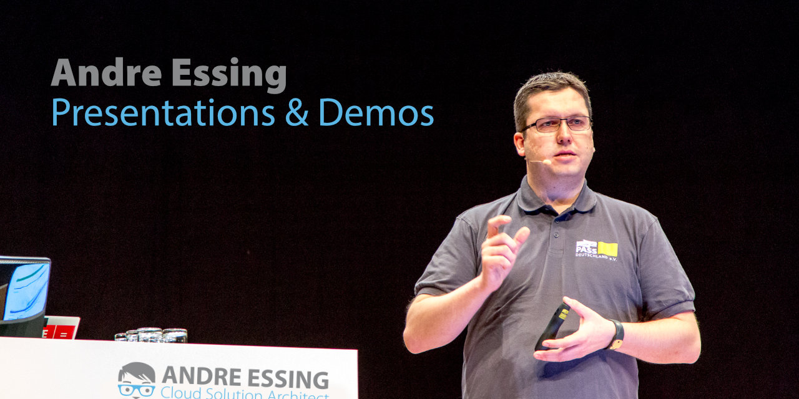

Data, Cloud, [Azure](https://azure.microsoft.com/) & [Azure Cosmos DB](https://azure.microsoft.com/services/cosmos-db/) Enthusiast, Community Addict and Cloud Solution Architect @ [Microsoft](https://www.microsoft.com/)

In my spare time I am speaking at user groups and at international conferences, teaching about cloud data services and how to use them in the best possible manner. Also, I am working on different small community and open-source projects.

This repository hosts slides and demos from presentations I did at conferences, user groups, meetups, and webcasts.

_The content of this repository is intended only as a supplement to my presentations, demos, and lectures._

## :compass: Find me on the web

If you have a question, or you just want to contact me, you can find and follow me on:

 
 

 

---

## :ambulance: Support Information

For further information about this project, how to [contribute](CONTRIBUTING.md), or how to contact us, please have a look at the [support document](SUPPORT.md) of this repository. It also contains information about [security related topics](SECURITY.md), [licensing](LICENSE.md), and more.  

## :man_judge: Disclaimer

THE CONTENT OF THIS REPOSITORY IS PROVIDED "AS IS", WITHOUT WARRANTY OF ANY KIND, EXPRESS OR IMPLIED, INCLUDING BUT NOT LIMITED TO THE WARRANTIES OF MERCHANTABILITY, FITNESS FOR A PARTICULAR PURPOSE AND NONINFRINGEMENT. IN NO EVENT SHALL THE AUTHORS BE LIABLE FOR ANY CLAIM, DAMAGES OR OTHER LIABILITY, WHETHER IN AN ACTION OF CONTRACT, TORT OR OTHERWISE, ARISING FROM, OUT OF OR IN CONNECTION WITH THE CONTENT OF THIS REPOSITORY OR THE USE OR OTHER DEALINGS BY CONTENT OF THIS REPOSITORY.
